# DTKit Design

## DTKit Ecosystem

DTKIT is composed of

* Validation procedures
* Conversion procedures
* HTTP interfaces
* Predefined outputs : Junit and Tusar
* Embedded metrics for JUnit or Tusar outputs
* External libraries and tools
* a NoSQL database

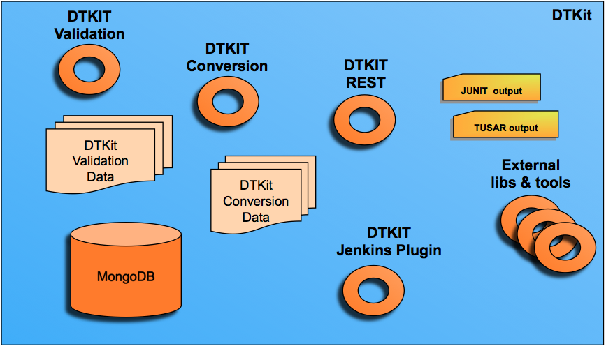

## DTKit Validation Mechanism

DTKit provides a validation procedure.
The validation component takes as inputs:

* a data file. Many differents (XML, TXT, CSV, ...) format are accepted
* a validation procedure (XSD or a java code)

DTkit provides the result of the validation (true of false) with error message when the validation fails.

The DTKIT validation procedure can be used by API (HTTP or not).

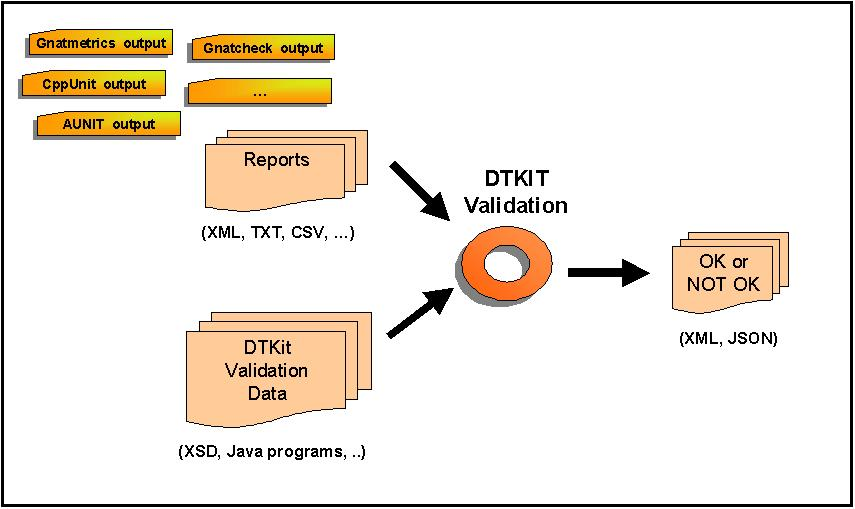

Under the hood, the validation procedure is delegated to an XML Schema (XSD) or a Java program

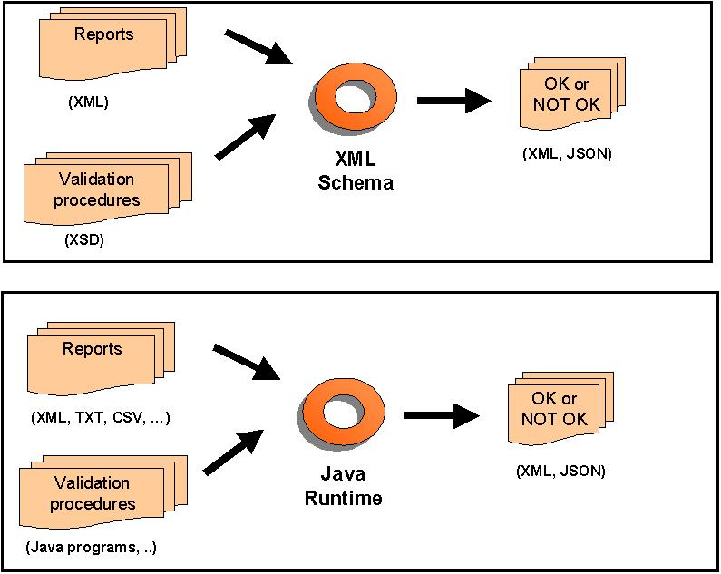

## DTKit Conversion Mechanism

DTKit provides a conversion procedure.
The conversion component takes as inputs:

* a data file. Many format (XML, TXT, CSV, ...) are accepted
* a conversion procedure (XSL or a java code)

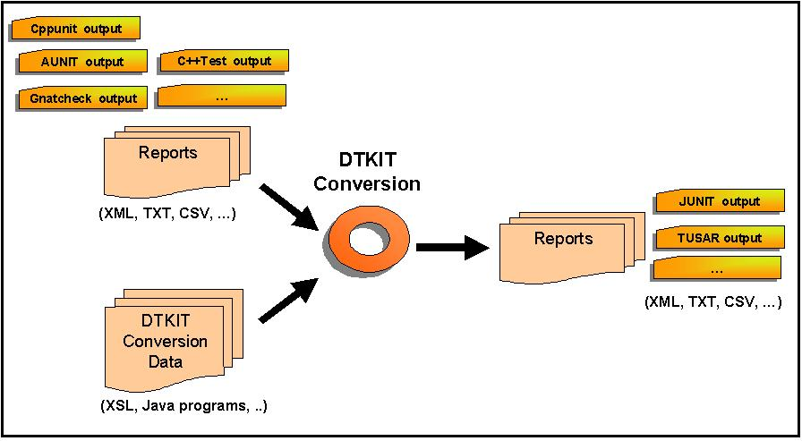

Under the hood, the conversion procedure is delegated to an eXtensible Style Sheet (XSL) or a Java program.
For the XSL procedure, the Saxon engine is used.

## DTKit Supported format

DTKit mainly supports two format:

* The JUnit format (standard Java based test format)
* The TUSAR format

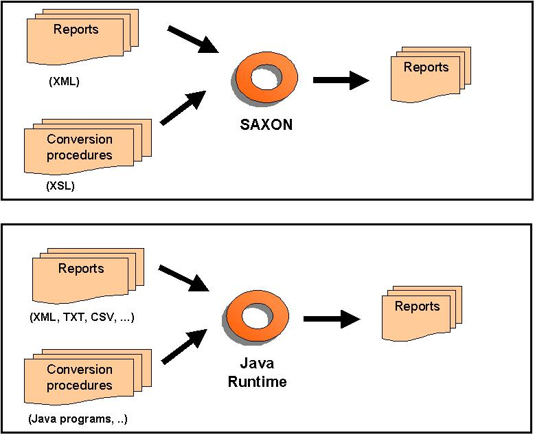

## DTkit Frmk for Model (current implementation)

DTKit provides one version for JUnit.

DTKit provides four versions for Tusar.

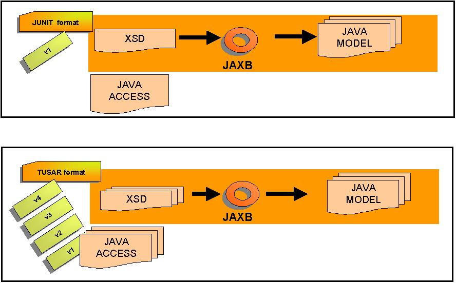

## DTKit Frmk for Model Packaging

Each managed format by DTKit are delivered with one jar.

Each jar contains:

* the XSD format files
* the associated file for providing some information about the format
* the generated java classes associated with XSD file for any manipulations if needed

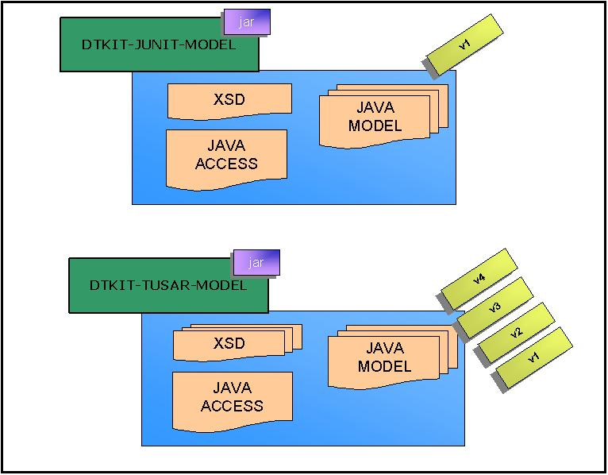

## DTkit Hudson Maven plugin

DTKit embeds lots of conversion and validation data for many tools. The embedded data are given by simple POJO files. And DTKit provides a Maven plugin for converting generic Java classes in Hudson classes.

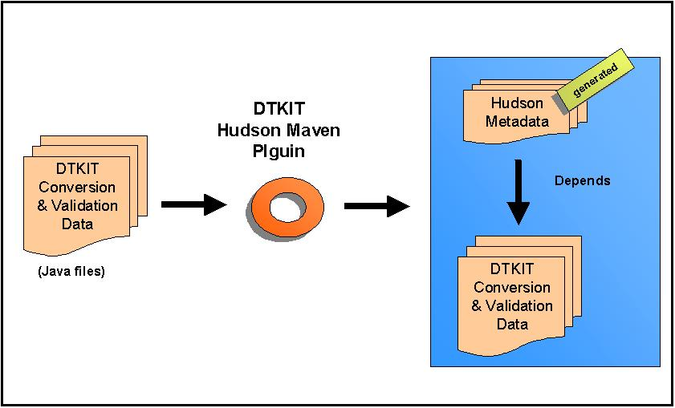

## DTKit Processor

DTKit provides a compile-time tool for generated meta-information (Java SPI files) for an annotation

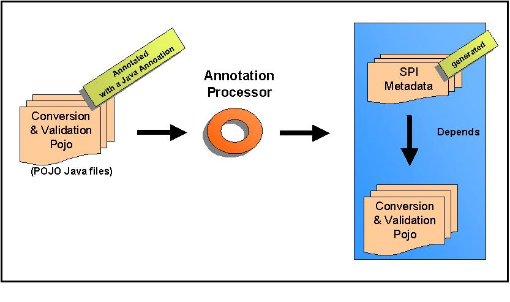

## DTKit Packaging

The main components are:

* dtkit-utils
* dtkit-default-junit
* dtkit-default-tusar
* dtkit-default-junit-hudson
* dtkit-default-tusar-hudson

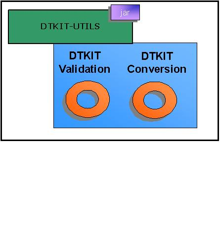

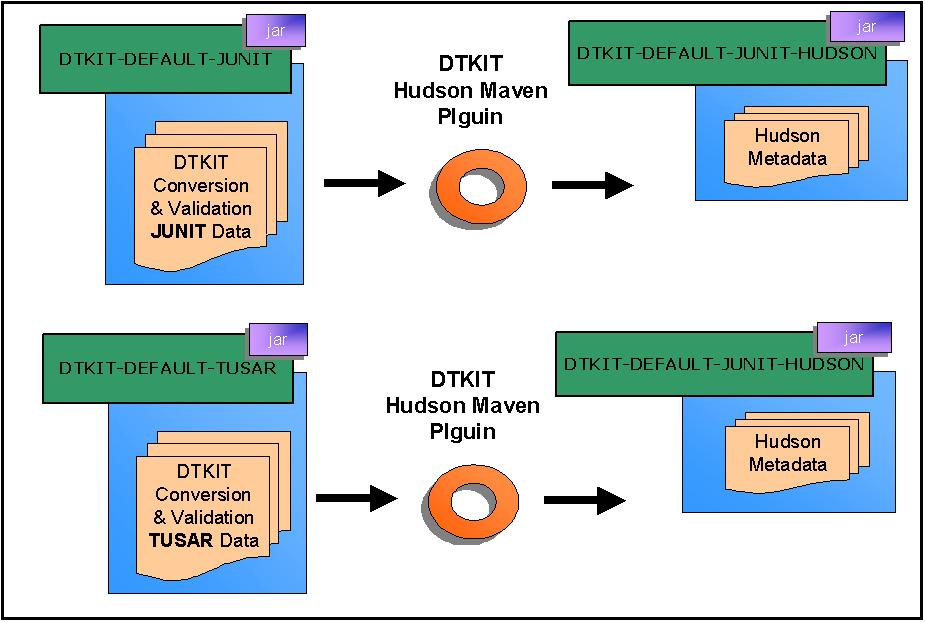

